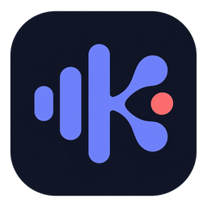
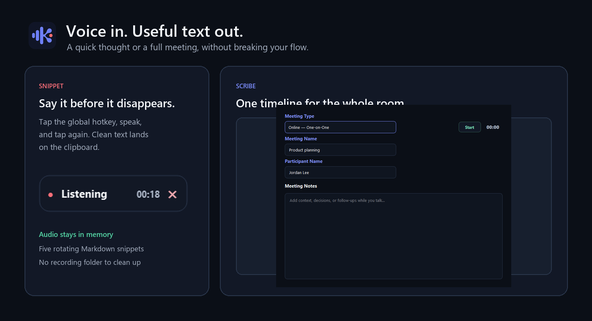
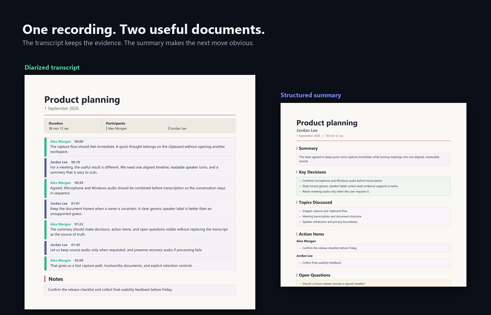

# Koe

**Catch a thought. Capture the room. Keep the useful part.**

`Windows 11` &nbsp;·&nbsp; `Python 3.13` &nbsp;·&nbsp;
`ElevenLabs · Deepgram · Mistral` &nbsp;·&nbsp;
`MIT source · GPLv3 application`

[](https://github.com/wadyatalkinabewt/koe/actions/workflows/tests.yml)

Koe is a Windows tray app built for the gap between *I should write that down*
and *what did we actually decide?* Tap a global hotkey for a quick voice
snippet, or open Scribe to capture microphone and system audio as a diarized
meeting transcript. With OpenRouter configured, Scribe can also produce a
structured meeting summary.

Koe stays out of the way and treats retention as part of the product: snippet
audio is ephemeral, while meeting audio is saved only when requested.

## Two ways to use it

| | Snippet | Scribe |
|---|---|---|
| **Best for** | Fleeting thoughts, prompts, and dictated text | Calls, interviews, and in-room meetings |
| **Capture** | Press the hotkey, speak, press again | Record microphone and Windows loopback together |
| **Result** | Formatted text on the clipboard | Diarized transcript PDF and Markdown; optional summary in both formats |
| **Audio retention** | Never written to disk | Kept only when requested; recovery audio survives failures |

<p align="center">
  
</p>

Scribe aligns microphone and loopback audio into **one mono timeline** before
uploading it. That avoids two separately transcribed recordings drifting out of
sync, duplicating speakers, or doubling the transcription work.

<p align="center">
  
</p>

### Built in layers

- **The pipeline is modular.** Capture, transcription, correction, speaker
  resolution, summarisation, and document rendering are separate modules.
  ElevenLabs Scribe v2 is the default transcription adapter; Deepgram Nova-3
  and Mistral Voxtral implement the same Snippet and Scribe contracts.
- **The optional summary model is easy to swap within OpenRouter.** It is
  selected in one place and sits behind a structured JSON contract. A
  replacement model still needs to honour that contract and pass the summary
  tests.
- **Post-transcription corrections are local and provider-independent.** They
  can fix recurring names or jargon without sending a private dictionary to a
  model provider.

The source map and the invariants between those modules are documented in
[the development guide](docs/DEVELOPMENT.md).

## Privacy is part of the pipeline

- Snippet audio stays in memory during normal use. Cancelling a recording keeps
  one recoverable WAV in Koe's logs folder; starting the next Snippet deletes it.
- Scribe uploads one aligned recording rather than separate microphone and
  loopback tracks.
- Successfully decoded ElevenLabs transcripts are deleted from ElevenLabs by
  transcription ID; failed deletions are retried and recorded locally.
- Deepgram and Mistral return synchronous transcription responses without the
  deletable transcript ID Koe uses for ElevenLabs. Their account retention
  policies therefore apply.
- Meeting source audio is retained only when enabled. Failed transcription
  attempts preserve recovery audio instead of silently destroying it.
- OpenRouter is confined to meeting post-processing and must use a Zero Data
  Retention endpoint.
- Custom corrections, settings, secrets, logs, recordings, and generated
  documents are excluded from Git.

For the exact meeting modes, storage paths, and failure behaviour, see the
[operator guide](docs/OPERATOR_GUIDE.md).

## Run from source

Koe currently targets **Windows 11** and **Python 3.13**. First-run setup lets
you choose ElevenLabs, Deepgram, or Mistral; ElevenLabs remains the default.
Create an
[ElevenLabs API key](https://elevenlabs.io/app/api/api-keys) with only
**Speech to Text → Access** enabled. Koe does not require User, History, or any
administrative permission. Deepgram and Mistral link directly to their key
consoles when selected. Setup checks the selected provider's actual
speech-to-text capability before saving it. An
[OpenRouter API key](https://openrouter.ai/workspaces/default/keys) is needed
only for model-assisted meeting summaries and contextual speaker resolution.
Without it, Scribe completes with the transcript alone. If OpenRouter fails,
Koe keeps the completed transcript, creates no diagnostic summary document,
and reports that the summary is unavailable.

```powershell
python -m venv .venv
.\.venv\Scripts\python.exe -m pip install -r requirements.txt
.\.venv\Scripts\python.exe run.py
```

The first-run window creates local settings. Source runs keep private runtime
state in the checkout; packaged runs use the current Windows profile. The
[development guide](docs/DEVELOPMENT.md) covers contributor setup, runtime
boundaries, architecture, and verification.

### Transcription providers

All three adapters support both the short in-memory Snippet path and Koe's
single-file Scribe path. Compatibility is covered by mocked API-contract tests;
the repository does not contain live provider credentials or claim live
end-to-end certification.

| Provider | Model | Snippet | Scribe speaker handling | Request limit enforced by Koe | ZDR | Post-response deletion |
|---|---|---:|---|---|---|---|
| ElevenLabs | Scribe v2 | Yes | All four modes; native diarization and one-on-one speaker cap | 3 GB / 10 hours | Enterprise option; not required | Koe deletes by transcription ID |
| Deepgram | Nova-3 | Yes | All four modes; native batch diarization (`latest`) | 2 GB | Account/contract dependent; not required | No deletable transcript ID returned |
| Mistral | Voxtral Mini Transcribe 2 | Yes | All four modes; native diarized segments | 500 MB / 60 minutes | Account/contract dependent; not required | No deletable transcript ID returned |

First-run setup writes the selected provider and matching key. To switch an
existing source checkout manually, add its key to `.env` and select the adapter
in the private `config.yaml`:

```dotenv
DEEPGRAM_API_KEY=your-key
# or: MISTRAL_API_KEY=your-key
```

```yaml
transcription_options:
  provider: deepgram  # elevenlabs, deepgram, or mistral
  corrections: {}
```

Deepgram's [API-key guide](https://developers.deepgram.com/docs/create-additional-api-keys)
and Mistral's [audio transcription guide](https://docs.mistral.ai/studio/audio/speech_to_text/offline_transcription)
cover account setup. OpenRouter's transcription endpoint is intentionally not a
Koe adapter: it has no documented speaker-diarization contract and its upstream
processing timeout is 60 seconds, so it does not satisfy Koe's full-recording,
speaker-labelled Scribe contract.

## Teach Koe your vocabulary

Add exact-token corrections to the private `config.yaml` used by the current
runtime:

- source run: `<checkout>\config.yaml`
- packaged run: `%LOCALAPPDATA%\Koe\config.yaml`

```yaml
transcription_options:
  corrections:
    ack me: Acme
```

Matching ignores case while preserving lower-, upper-, or title-style casing.
Corrections run locally after transcription. The real configuration is private
and must never be committed.

## Follow the build

This repository preserves Koe's development history rather than presenting a
single polished snapshot:

[Commit activity](https://github.com/wadyatalkinabewt/koe/graphs/commit-activity)
&nbsp;·&nbsp;
[Contributors graph](https://github.com/wadyatalkinabewt/koe/graphs/contributors)
&nbsp;·&nbsp;
[Commit log](https://github.com/wadyatalkinabewt/koe/commits/main)
&nbsp;·&nbsp;
[Repository insights](https://github.com/wadyatalkinabewt/koe/pulse)

## License

Koe's original source code is released under the [MIT License](LICENSE). Koe
uses the GPLv3 build of PyQt5, so the combined Koe and PyQt5 application must be
distributed under the [GNU General Public License v3](COPYING.GPL-3.0).
Third-party dependencies retain their own licences. See
[Riverbank's PyQt licensing terms](https://www.riverbankcomputing.com/software/pyqt)
for the alternative commercial licence.
